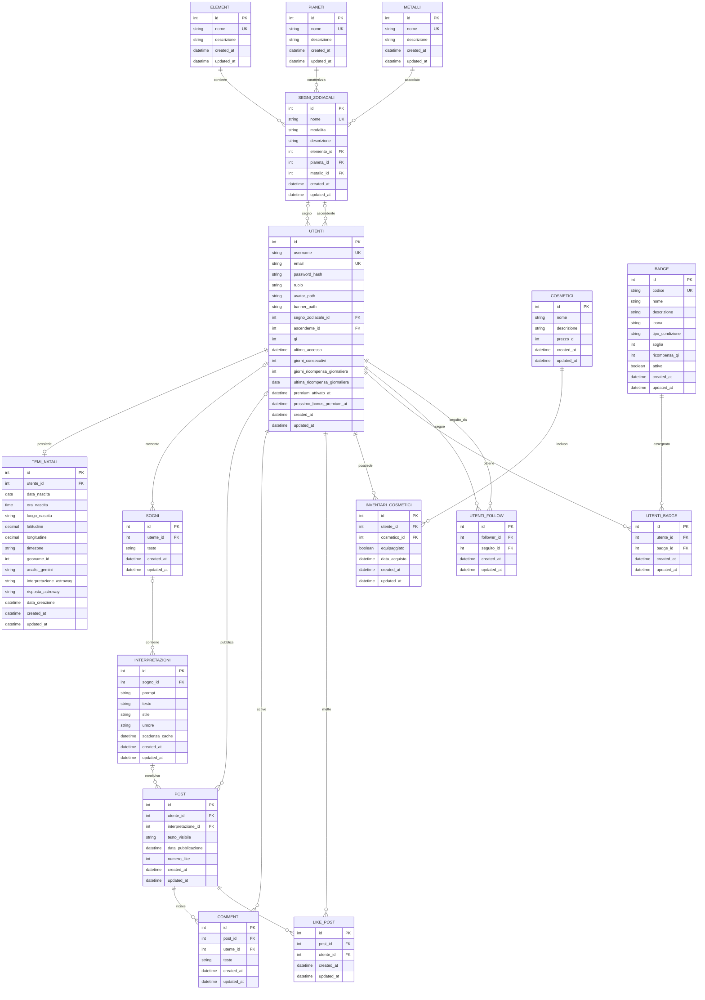

# SomniaZodiaca

## Indice

- [Panoramica](#panoramica)
- [Stack tecnologico](#stack-tecnologico)
- [Architettura](#architettura)
- [Prerequisiti](#prerequisiti)
- [Avvio del progetto](#avvio-del-progetto)
- [Credenziali demo](#credenziali-demo)
- [Database e migration](#database-e-migration)
- [Struttura del progetto](#struttura-del-progetto)
- [Parametri di dominio configurabili](#parametri-di-dominio-configurabili)
- [API esterne utilizzate](#api-esterne-utilizzate)
- [Troubleshooting](#troubleshooting)
- [Autore](#autore)

---

## Panoramica

SomniaZodiaca è un'applicazione social a tema onirico-astrologico che
permette agli utenti di registrare i propri sogni e riceverne
un'interpretazione generata tramite intelligenza artificiale (Gemini),
oltre a calcolare il proprio tema natale a partire da data, ora e
luogo di nascita.

**Funzionalità principali:**
- Registrazione dei sogni e generazione dell'interpretazione nella
  pagina "Oracolo"
- Calcolo del tema natale (segno zodiacale, ascendente, posizioni
  planetarie) con interpretazione astrologica raffinata da IA
- Feed social: pubblicazione di post, commenti, like tra utenti
- Sistema di follow tra utenti
- Gamification: punti QI, badge, cosmetici sbloccabili ed equipaggiabili
  per personalizzare il proprio profilo
- Ricompense giornaliere per l'accesso continuativo
- Profili con avatar e banner personalizzabili
- Ruoli utente differenziati (base, premium, admin)

## Stack tecnologico

| Componente        | Tecnologia         |
|--------------------|---------------------|
| Linguaggio          | Java 21 |
| Framework           | Spring Boot <!-- versione --> |
| Database            | MySQL 8.X |
| Migration DB        | Flyway |
| ORM                 | Hibernate / JPA |
| Sicurezza           | Spring Security |
| Containerizzazione  | Docker, Docker Compose |
| Build tool          | Maven |

## Architettura

### Flusso di avvio:

1. `docker compose up` avvia il container `db` (MySQL) e attende l'healthcheck
2. Il container `app` parte solo dopo che `db` è `healthy`
3. All'avvio dell'app, Flyway esegue le migration in ordine, PRIMA di qualsiasi
   ApplicationRunner/CommandLineRunner:
   - V1__init_schema.sql   -> crea tutte le tabelle
   - V2__seed_post.sql     -> crea utenti demo e post
   - V3__seed_interpretazioni.sql -> crea sogni/interpretazioni demo
4. Solo dopo che il context Spring è pronto, partono i runner applicativi:
   - AdminInitializer      -> crea/aggiorna l'utente admin (e i suoi sogni demo)
   - Generatore immagini profilo -> genera le immagini per gli utenti che non
     ce l'hanno ancora (quindi anche per gli utenti appena creati dal seed)

<!-- Considera di aggiungere qui un diagramma (anche solo Mermaid, es. sequenceDiagram
o flowchart) che mostra: db -> flyway -> hibernate validate -> runners. -->

## Prerequisiti

- Per una esecuzione con Docker: Docker e Docker Compose
- Per una esecuzione locale: JDK 21, Maven, MySQL server

## Avvio del progetto

> Istruzioni testate solo su Windows, i comandi potrebbero essere diversi per altri sistemi operativi

### Docker

Assicurati di avere Docker Engine avviato, poi clona il progetto usando Git Bash:

```bash
git clone <url-repository>
cd Somnia-Zodiaca
```

Crea il file `.env` copiando il template e valorizza le variabili richieste:

```bash
cp .env.example .env
```

Apri `.env` e inserisci le tue credenziali:

```env
GEMINI_API_KEY=...
ASTROWAY_API_KEY=...
GEONAMES_USERNAME=...
DATABASE_PASSWORD=...
DATABASE_USERNAME=...
```

Avvia l'applicazione:

```bash
docker compose up --build
```

Per collegarsi all'applicazione bisogna connettersi a http://localhost:8080/

Per spegnere l'applicazione e il database, scegli una delle due opzioni:

- Premere `Ctrl + C` nel terminale in cui è in esecuzione
- Oppure, da un nuovo terminale:
```bash
  docker compose down
```

Per ripartire da un database completamente pulito:

```bash
docker compose down -v
docker compose up --build
```

### Esecuzione locale

Assicurati di avere un'istanza MYSQL 8.x in esecuzione e raggiungibile alla porta 3306, poi clona il progetto usando Git Bash:

```bash
git clone <url-repository>
cd Somnia-Zodiaca
```

Crea il file `.env` copiando il template e valorizza le variabili richieste:

```bash
cp .env.example .env
```

Apri `.env` e inserisci le tue credenziali:

```env
GEMINI_API_KEY=...
ASTROWAY_API_KEY=...
GEONAMES_USERNAME=...
DATABASE_PASSWORD=...
DATABASE_USERNAME=...
```

Crea il database, scegli una delle tre opzioni:
- avendo configurato la variabile PATH per mysql ([vedi istruzioni](https://dev.mysql.com/doc/mysql-windows-excerpt/8.0/en/mysql-installation-windows-path.html)) esegui questo comando e immetti la password di MYSQL richiesta:

```bash
mysql -u root -p < ./GenerazioneDatabase.sql
```

- avendo creato una connessione al server MYSQL con l'IDE scelto ([vedi istruzioni per VSCode](https://dev.mysql.com/doc/mysql-shell-gui/en/mysql-shell-for-vscode-setup.html#mysql-shell-for-vscode-setup-install)) apri GenerazioneDatabase.sql ed eseguilo

- avendo installato MYSQL Workbench ([vedi istruzioni](https://dev.mysql.com/downloads/workbench/)) esegui il file GenerazioneDatabase.sql dentro il workbench

Avvia l'applicazione:

```bash
./mvnw.cmd spring-boot:run
```

Per spegnere l'applicazione:

- Premere `Ctrl + C` nel terminale in cui è in esecuzione

Per ripartire da un database completamente pulito, con l'applicazione spenta esegui il file GenerazioneDatabase.sql

### Cosa accade all'avvio

Al primo avvio, in automatico:
- viene creato lo schema del database (Flyway)
- vengono inseriti utenti demo, post, sogni e interpretazioni di esempio
- viene creato l'utente admin
- vengono generate le immagini profilo per tutti gli utenti demo

## Credenziali demo

> Solo per ambiente locale/sviluppo - non usare in produzione.

| Ruolo   | Username         | Password           |
|---------|-------------------|----------------------|
| Admin   | `admin`            | `SomniaDemo2026!`     |
| Base/Premium    | `sofia_rossi`,`luca_ferrari`,`marco_bianchi`,`giulia_conti`,`elisa_romano` | `Password123!` |

## Database e migration

- Le migration si trovano in `src/main/resources/db/migration/`
- Convenzione di naming: `V<numero>__descrizione.sql` (doppio underscore)

Elenco migration attuali:

| File | Contenuto |
|---|---|
| `V1__init_schema.sql` | Creazione di tutte le tabelle, vincoli unique, foreign key |
| `V2__seed_post.sql` | Utenti demo e post di esempio |
| `V3__seed_interpretazioni.sql` | Sogni e interpretazioni di esempio per gli utenti demo |

**Schema del database**

<details>
<summary>Diagramma ER (click per espandere)</summary>



</details>

## Struttura del progetto

```
src/main/java/com/azoth/somniazodiaca
  ├── config
  ├── controllers
  │    └── api
  ├── converters
  ├── dtos
  │    └── records
  ├── entities
  ├── enums
  ├── exceptions
  ├── repositories
  ├── security
  ├── services
  └── SomniazodiacaApplication.java
src/main/resources/
  ├── db/migration/          # migration Flyway
  ├── static/
  ├── templates/
  ├── app-domain.properties  # parametri di business configurabili
  ├── application.properties
  └── logback-spring.xml
uploads/profiles             # immagini profilo generate a runtime
docker-compose.yml
Dockerfile
erDiagram.mmd                # schema del database 
GenerazioneDatabase.sql      # creazione DB per esecuzione locale
pom.xml
README.md
```


## Parametri di dominio configurabili

Il file [`app-domain.properties`](</src/main/resources/app-domain.properties>) contiene
i parametri di business dell'applicazione, modificabili senza dover
intervenire sul codice (costi, limiti, prezzi, ricompense).

Principali gruppi di parametri:

| Ambito | Parametri | Descrizione |
|---|---|---|
| **Oracolo** | `app.domain.oracolo.*` | Costo (in QI) per generare/rigenerare un'interpretazione, durata della cache, limiti di caratteri per sogno e interpretazione |
| **Wallet** | `app.domain.wallet.*` | Ricompense giornaliere progressive per l'accesso continuativo; pacchetti di QI acquistabili (nome, quantità, bonus, prezzo) |
| **Premium** | `app.domain.premium.*` | Prezzo dell'abbonamento mensile, QI mensili inclusi, numero di interpretazioni gratuite settimanali |
| **Contenuti** | `app.domain.contenuti.*` | Limiti di caratteri per post e commenti, lunghezza minima della password |

Per modificare uno di questi valori (es. bilanciare i costi in QI o i
prezzi dei pacchetti), è sufficiente editare `app-domain.properties` e
riavviare l'applicazione — non è richiesta nessuna modifica al codice
Java.

## API esterne utilizzate

Il progetto si integra con le seguenti API esterne:

| API | Utilizzo | Documentazione |
|---|---|---|
| [Google Gemini](https://ai.google.dev/) | Genera l'interpretazione del sogno nella pagina Oracolo; rielabora e migliora la prima interpretazione del tema natale prodotta da AstroWay | https://ai.google.dev/gemini-api/docs |
| [GeoNames](https://www.geonames.org/) | Converte il luogo di nascita (inserito come nome) nelle relative coordinate geografiche | https://www.geonames.org/export/web-services.html |
| [AstroWay](https://api.astroway.info) | Calcola i dati astrologici del tema natale e genera una prima interpretazione, poi raffinata da Gemini | https://api.astroway.info/en/overview/ |

Le chiavi/credenziali per ciascuna API vanno configurate nel file `.env` (vedi sezioni [Docker](#docker) / [Esecuzione locale](#esecuzione-locale)).

## Troubleshooting

**`Migrations have failed validation` / `Detected failed migration`**
Una migration precedente è fallita a metà lasciando lo storico Flyway
inconsistente. In ambiente locale, ripulire con:
```bash
docker compose down -v
docker compose up --build
```

## Autori

- Maurizio Carugo
- Davide Focarete
- Alberto Camoirano | [github](https://github.com/Hutch9910)
